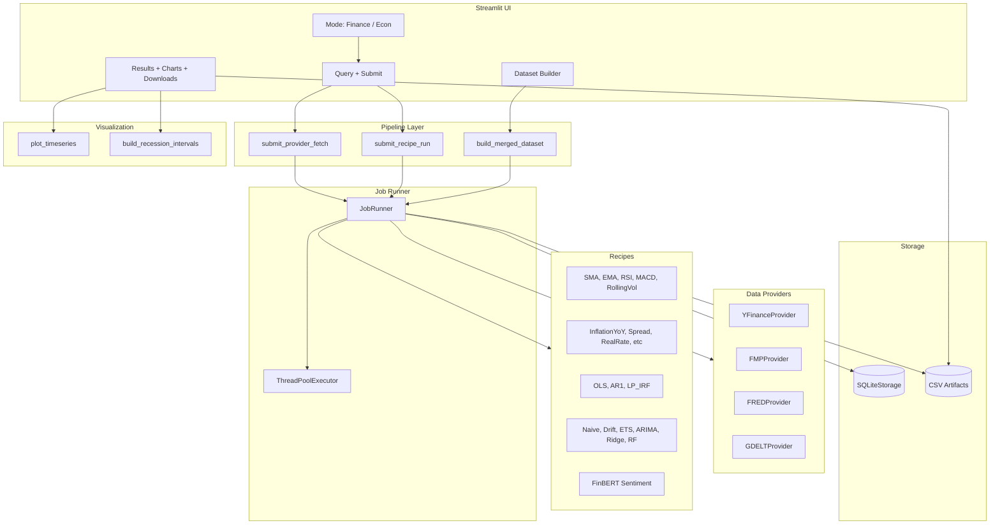

# Feature Summary — Economics Data Suite

## Executive Overview

This economics "data suite" is a **local-first** Streamlit application that fetches financial and macroeconomic data, runs transformations and econometric models, and produces forecasts and visualizations. Data flows through a **job-based pipeline**: providers fetch raw data, recipes transform or model it, and results are persisted as CSV artifacts. The UI supports two modes—**Finance** (market tickers, technical indicators, forecasts) and **Econ** (FRED series, macro transforms, econometric models)—plus a **Dataset Builder** for merging multiple series into aligned time series datasets. No REST API; all interaction is via the Streamlit UI or the CLI smoke test script.

---

## Architecture & Data Flow



---

## Configuration & Feature Gating

| Env Var | Purpose |
|---------|---------|
| `FINREC_DB_PATH` | SQLite database path (default: `data/finrec.db`) |
| `FINREC_RESULTS_DIR` | CSV artifact output directory (default: `data/results`) |
| `FINREC_FMP_API_KEY` | API key for FMP provider (required when using `fmp`) |

**Optional extras** (pyproject.toml): `dev`, `market`, `macro`, `news`, `ml`, `econ`, `forecast`. Providers and recipes that depend on optional packages are registered only when those packages are installed; runtime calls use `require_optional()` and raise a friendly install hint if missing.

---

## Taxonomy & Feature Index

| # | Feature | Category | Anchor |
|---|---------|----------|--------|
| 1 | YFinanceProvider | Data Ingestion | [#yfinance-provider](#yfinance-provider) |
| 2 | FMPProvider | Data Ingestion | [#fmp-provider](#fmp-provider) |
| 3 | FREDProvider | Data Ingestion | [#fred-provider](#fred-provider) |
| 4 | GDELTProvider | Data Ingestion | [#gdelt-provider](#gdelt-provider) |
| 5 | ProviderRegistry | Infra | [#provider-registry](#provider-registry) |
| 6 | Provider base protocol | Infra | [#provider-base](#provider-base) |
| 7 | NaiveForecastRecipe | Forecasting | [#naive-forecast](#naive-forecast) |
| 8 | DriftForecastRecipe | Forecasting | [#drift-forecast](#drift-forecast) |
| 9 | ETSForecastRecipe | Forecasting | [#ets-forecast](#ets-forecast) |
| 10 | ARIMAForecastRecipe | Forecasting | [#arima-forecast](#arima-forecast) |
| 11 | RidgeLagForecastRecipe | Forecasting | [#ridge-lag-forecast](#ridge-lag-forecast) |
| 12 | RandomForestLagForecastRecipe | Forecasting | [#rf-lag-forecast](#rf-lag-forecast) |
| 13 | Forecast utilities | Infra | [#forecast-utilities](#forecast-utilities) |
| 14 | InflationYoYRecipe | Macro Transform | [#inflation-yoy](#inflation-yoy) |
| 15 | InflationMoMAnnRecipe | Macro Transform | [#inflation-mom-ann](#inflation-mom-ann) |
| 16 | GrowthQoQAnnRecipe | Macro Transform | [#growth-qoq-ann](#growth-qoq-ann) |
| 17 | SpreadRecipe | Macro Transform | [#spread](#spread) |
| 18 | RealRateRecipe | Macro Transform | [#real-rate](#real-rate) |
| 19 | OLSRecipe | Econometrics | [#ols](#ols) |
| 20 | AR1Recipe | Econometrics | [#ar1](#ar1) |
| 21 | LocalProjectionIRFRecipe | Econometrics | [#lp-irf](#lp-irf) |
| 22 | FinBERTDailySentimentRecipe | News Processing | [#finbert-sentiment](#finbert-sentiment) |
| 23 | SimpleMovingAverageRecipe | Technical | [#sma](#sma) |
| 24 | ExponentialMovingAverageRecipe | Technical | [#ema](#ema) |
| 25 | RSIRecipe | Technical | [#rsi](#rsi) |
| 26 | MACDRecipe | Technical | [#macd](#macd) |
| 27 | RollingVolatilityRecipe | Technical | [#rolling-vol](#rolling-vol) |
| 28 | LogReturnsRecipe | Time Series | [#log-returns](#log-returns) |
| 29 | RollingZScoreRecipe | Time Series | [#rolling-zscore](#rolling-zscore) |
| 30 | RecipeRegistry | Infra | [#recipe-registry](#recipe-registry) |
| 31 | Recipe base protocol | Infra | [#recipe-base](#recipe-base) |
| 32 | SQLiteStorage | Storage | [#sqlite-storage](#sqlite-storage) |
| 33 | JobRunner | Orchestration | [#job-runner](#job-runner) |
| 34 | Pipeline submission | Orchestration | [#pipeline-submission](#pipeline-submission) |
| 35 | build_merged_dataset | Datasets | [#dataset-merge](#dataset-merge) |
| 36 | plot_timeseries | Visualization | [#plot-timeseries](#plot-timeseries) |
| 37 | build_recession_intervals | Visualization | [#recession-intervals](#recession-intervals) |
| 38 | Time series catalog | UI | [#timeseries-catalog](#timeseries-catalog) |
| 39 | AppConfig / load_config | Config | [#config-loader](#config-loader) |
| 40 | Optional dependency helpers | Infra | [#optional-deps](#optional-deps) |
| 41 | Main Streamlit app | UI | [#streamlit-app](#streamlit-app) |
| 42 | Legacy pages | UI | [#legacy-pages](#legacy-pages) |
| 43 | E2E smoke script | Scripts | [#e2e-smoke](#e2e-smoke) |

---

## Feature Writeups

### Data Ingestion

#### YFinanceProvider {#yfinance-provider}

**What it is:** Fetches market OHLCV data via the yfinance library (Yahoo Finance).

**Technical explanation:**
- Uses `yfinance.Ticker(symbol).history()` with date range or fallback `n` rows.
- Rate limiting: global throttle (default 3s between requests) and retry with backoff (3s, 10s, 30s, 60s) on `YFRateLimitError`.
- Output columns: `date`, `symbol`, `open`, `high`, `low`, `close`, `volume`.

**Assumptions / constraints:** Yahoo can rate-limit; throttle and retries reduce failures. Requires `yfinance` (optional extra `market`).

**Where it appears:** `src/finrec/providers/market/yfinance.py` — `YFinanceProvider`

**Code snippet:**

```python
# src/finrec/providers/market/yfinance.py (lines 38-46)
@dataclass
class YFinanceProvider(Provider):
    meta: ProviderMeta = ProviderMeta(
        id="yfinance",
        name="yfinance",
        kind="market",
    )

    def fetch(self, request: dict, ctx) -> pd.DataFrame:
        yf = require_optional("yfinance", extra_hint="market")
```

**Non-technical intuition:** Pulls stock price history from Yahoo Finance. Handles rate limits by waiting between requests and retrying if blocked.

---

#### FMPProvider {#fmp-provider}

**What it is:** Fetches market OHLCV data from Financial Modeling Prep (FMP) API.

**Technical explanation:**
- Uses stable EOD endpoint: `https://financialmodelingprep.com/stable/historical-price-eod/full`.
- Daily bars only; `interval` other than `1d` is ignored.
- On 402 (premium symbol) errors, falls back to `YFinanceProvider` when available.

**Assumptions / constraints:** Requires `FINREC_FMP_API_KEY` in `.env`. Free-tier symbols may return 402; fallback to yfinance is attempted.

**Where it appears:** `src/finrec/providers/market/fmp.py` — `FMPProvider`

**Code snippet:**

```python
# src/finrec/providers/market/fmp.py (lines 27-47)
@dataclass
class FMPProvider(Provider):
    meta: ProviderMeta = ProviderMeta(
        id="fmp",
        name="Financial Modeling Prep (FMP)",
        kind="market",
    )

    def fetch(self, request: dict, ctx) -> pd.DataFrame:
        requests = require_optional("requests", extra_hint="market")
        api_key = (os.getenv("FINREC_FMP_API_KEY") or "").strip()
        if not api_key:
            raise ValueError("Missing FINREC_FMP_API_KEY...")
```

**Non-technical intuition:** Gets stock prices from FMP. If a symbol needs a paid plan, the app tries Yahoo Finance instead.

---

#### FREDProvider {#fred-provider}

**What it is:** Fetches macroeconomic time series from FRED via pandas-datareader.

**Technical explanation:**
- Uses `pandas_datareader.data.DataReader(series_id, "fred", start, end)`.
- Output: `date`, `series_id`, `value`.
- End date clamped to today (FRED has no future data).

**Assumptions / constraints:** Requires `pandas-datareader` (optional extra `macro`).

**Where it appears:** `src/finrec/providers/macro/fred.py` — `FREDProvider`

**Code snippet:**

```python
# src/finrec/providers/macro/fred.py (lines 13-55)
@dataclass
class FREDProvider(Provider):
    meta: ProviderMeta = ProviderMeta(
        id="fred",
        name="FRED (pandas-datareader)",
        kind="macro",
    )

    def fetch(self, request: dict, ctx) -> pd.DataFrame:
        pdr_data = require_optional("pandas_datareader.data", extra_hint="macro")
        series_id = str(request.get("series_id", "CPIAUCSL")).upper()
        # ...
        df = pdr_data.DataReader(series_id, "fred", start, end)
```

**Non-technical intuition:** Downloads economic indicators (CPI, unemployment, etc.) from the Federal Reserve’s FRED database.

---

#### GDELTProvider {#gdelt-provider}

**What it is:** Fetches news articles from the GDELT document API.

**Technical explanation:**
- Endpoint: `https://api.gdeltproject.org/api/v2/doc/doc` with `mode=ArtList`, `format=json`.
- Rate limit: 5s throttle; retry on 429.
- Supports `sourcelang:` filter for language restriction.
- Query normalization: wraps OR terms in parentheses if needed.

**Assumptions / constraints:** Requires `start_date` and `end_date`. Max records typically 250. Requires `requests` (optional extra `news`).

**Where it appears:** `src/finrec/providers/news/gdelt.py` — `GDELTProvider`

**Code snippet:**

```python
# src/finrec/providers/news/gdelt.py (lines 74-86)
@dataclass
class GDELTProvider(Provider):
    meta: ProviderMeta = ProviderMeta(
        id="gdelt",
        name="GDELT (doc API)",
        kind="news",
    )

    def fetch(self, request: dict, ctx) -> pd.DataFrame:
        requests = require_optional("requests", extra_hint="news")
        query = _normalize_gdelt_query(str(request.get("query", "inflation")))
```

**Non-technical intuition:** Retrieves news articles matching a search query from GDELT, with optional language filters.

---

### Infrastructure

#### ProviderRegistry {#provider-registry}

**What it is:** Registry for data providers with lazy registration based on optional dependencies.

**Technical explanation:** `get_registry()` returns a singleton. `_try_register_real_providers()` registers yfinance, fmp, fred, gdelt only if their dependencies are available. Keys are `{kind}:{provider_id}`.

**Where it appears:** `src/finrec/providers/registry.py` — `ProviderRegistry`, `get_registry()`

**Code snippet:**

```python
# src/finrec/providers/registry.py (lines 77-84)
def get_registry() -> ProviderRegistry:
    global _REGISTRY
    if _REGISTRY is None:
        reg = ProviderRegistry(_providers={})
        _try_register_real_providers(reg)
        _REGISTRY = reg
    return _REGISTRY
```

**Non-technical intuition:** Central list of data sources; only those whose libraries are installed show up.

---

#### Provider base protocol {#provider-base}

**What it is:** Protocol defining the provider interface.

**Technical explanation:** `Provider` has `meta: ProviderMeta` and `fetch(request, ctx) -> DataFrame`. `ProviderKind` is `"market" | "macro" | "news"`.

**Where it appears:** `src/finrec/providers/base.py` — `ProviderMeta`, `Provider`, `JobContext`

**Code snippet:**

```python
# src/finrec/providers/base.py (lines 11-29)
@dataclass(frozen=True)
class ProviderMeta:
    id: str
    name: str
    kind: ProviderKind

class Provider(Protocol):
    meta: ProviderMeta
    def fetch(self, request: dict, ctx: JobContext) -> pd.DataFrame: ...
```

**Non-technical intuition:** Contract that every data source must implement: metadata plus a fetch method.

---

### Forecasting

#### NaiveForecastRecipe {#naive-forecast}

**What it is:** Baseline forecast using the last observed training value for all future steps.

**Technical explanation:**
- \(\hat{y}_{t+h} = y_T\) for all \(h \geq 1\), where \(T\) is the last training index.
- Uses `build_target_series`, `split_train_test`, `build_forecast_output` from forecast utils.

**Assumptions / constraints:** Needs at least one non-NaN training observation. Best as a baseline; no trend or seasonality.

**Where it appears:** `src/finrec/recipes/forecast/naive.py` — `NaiveForecastRecipe`

**Code snippet:**

```python
# src/finrec/recipes/forecast/naive.py (lines 19-48)
@dataclass
class NaiveForecastRecipe(Recipe):
    meta: RecipeMeta = RecipeMeta(
        id="forecast_naive",
        name="Forecast: Naive",
        description="Forecasts future values as the last observed training value (baseline).",
    )

    def run(self, df: pd.DataFrame, params: dict, ctx) -> pd.DataFrame:
        # ...
        last = float(train_y.dropna().iloc[-1])
        test_yhat = [last] * n_test
        fcst_yhat = [last] * len(future_dates)
```

**Non-technical intuition:** Assumes tomorrow will look like today—the simplest possible forecast, useful as a benchmark.

---

#### DriftForecastRecipe {#drift-forecast}

**What it is:** Linear drift forecast from first to last training value.

**Technical explanation:**
- \(\hat{y}_{t+h} = y_T + \frac{y_T - y_0}{T-1} \cdot h\), where \(y_0, y_T\) are first and last training values.
- Requires at least 2 training observations.

**Where it appears:** `src/finrec/recipes/forecast/naive.py` — `DriftForecastRecipe`

**Code snippet:**

```python
# src/finrec/recipes/forecast/naive.py (lines 71-106)
@dataclass
class DriftForecastRecipe(Recipe):
    meta: RecipeMeta = RecipeMeta(
        id="forecast_drift",
        name="Forecast: Drift",
        description="Forecasts using a linear drift from first to last training observation (baseline).",
    )
    # ...
    drift = (yT - y0) / max(1, (n_train - 1))
    def _path(steps: int) -> list[float]:
        return [yT + drift * (k + 1) for k in range(steps)]
```

**Non-technical intuition:** Extends the straight line from the first to the last historical point into the future.

---

#### ETSForecastRecipe {#ets-forecast}

**What it is:** Exponential smoothing (Holt-Winters) forecasting.

**Technical explanation:**
- Uses `statsmodels.tsa.holtwinters.ExponentialSmoothing` with configurable trend and seasonal components.
- Formula (additive): level \(L_t\), trend \(b_t\), seasonal \(s_t\); forecast combines them.
- Requires ≥10 training observations.

**Assumptions / constraints:** Needs `statsmodels` (optional extra `forecast`). Seasonal period must be set for seasonal models.

**Where it appears:** `src/finrec/recipes/forecast/ets.py` — `ETSForecastRecipe`

**Code snippet:**

```python
# src/finrec/recipes/forecast/ets.py (lines 56-64)
model = sm_hw.ExponentialSmoothing(
    y_train,
    trend=trend,
    seasonal=seasonal,
    seasonal_periods=seasonal_periods,
)
res = model.fit(optimized=True)
preds = res.forecast(steps)
```

**Non-technical intuition:** Smooths past data and extrapolates level, trend, and optionally seasonality.

---

#### ARIMAForecastRecipe {#arima-forecast}

**What it is:** ARIMA(p,d,q) forecasting with AIC-based order selection.

**Technical explanation:**
- Model: \(y_t = c + \phi_1 y_{t-1} + \cdots + \phi_p y_{t-p} + \theta_1 \varepsilon_{t-1} + \cdots + \theta_q \varepsilon_{t-q}\) (with differencing order \(d\)).
- Grid search over `p_values`, `d_values`, `q_values`; selects order with lowest AIC.
- Produces confidence intervals via `get_forecast().conf_int(alpha)`.

**Assumptions / constraints:** Needs ≥20 training observations. Requires `statsmodels`. All grid fits can fail if data is problematic.

**Where it appears:** `src/finrec/recipes/forecast/arima.py` — `ARIMAForecastRecipe`

**Code snippet:**

```python
# src/finrec/recipes/forecast/arima.py (lines 60-76)
orders = list(itertools.product(list(p_vals), list(d_vals), list(q_vals)))
for (p, d, q) in orders:
    order = (int(p), int(d), int(q))
    try:
        model = sm_sarimax.SARIMAX(y_train, order=order, trend="c", ...)
        res = model.fit(disp=False)
        aic = float(getattr(res, "aic", float("inf")))
        if aic < best_aic:
            best_aic, best_res, best_order = aic, res, order
```

**Non-technical intuition:** Fits a flexible time-series model and picks the best complexity using AIC, then forecasts with uncertainty bands.

---

#### RidgeLagForecastRecipe {#ridge-lag-forecast}

**What it is:** Ridge regression on lagged values with recursive multi-step forecasting.

**Technical explanation:**
- Features: last `lookback` values plus optional rolling mean/std.
- Model: `StandardScaler` + `Ridge(alpha)`.
- Recursive forecast: predict one step, append to window, repeat.

**Assumptions / constraints:** Needs `sklearn` (optional extra `forecast`). Requires `lookback + 5` observations.

**Where it appears:** `src/finrec/recipes/forecast/ml_lags.py` — `RidgeLagForecastRecipe`

**Code snippet:**

```python
# src/finrec/recipes/forecast/ml_lags.py (lines 96-98)
X_train, y_train_sup = _build_supervised(train_y, lookback=lookback, include_stats=include_stats)
model = sk_pipe.make_pipeline(sk_pre.StandardScaler(), sk_linear.Ridge(alpha=alpha))
model.fit(X_train, y_train_sup)
```

**Non-technical intuition:** Uses recent history as inputs to a regularized linear model to predict the next value, then feeds predictions back for further steps.

---

#### RandomForestLagForecastRecipe {#rf-lag-forecast}

**What it is:** Random Forest on lag features with recursive multi-step forecasting.

**Technical explanation:** Same feature construction as Ridge; uses `RandomForestRegressor` instead. Parameters: `n_estimators`, `max_depth`.

**Where it appears:** `src/finrec/recipes/forecast/ml_lags.py` — `RandomForestLagForecastRecipe`

**Code snippet:**

```python
# src/finrec/recipes/forecast/ml_lags.py (lines 164-170)
X_train, y_train_sup = _build_supervised(train_y, lookback=lookback, include_stats=include_stats)
model = sk_ens.RandomForestRegressor(
    n_estimators=n_estimators,
    random_state=0,
    max_depth=max_depth,
    n_jobs=1,
)
model.fit(X_train, y_train_sup)
```

**Non-technical intuition:** Same lag-based setup as Ridge, but uses an ensemble of trees for potentially nonlinear patterns.

---

#### Forecast utilities {#forecast-utilities}

**What it is:** Shared helpers for forecast recipes: target building, train/test split, output schema, future dates.

**Technical explanation:**
- `build_target_series`: parses dates, optionally applies `log_return` transform.
- `split_train_test`: reserves `test_size` fraction (or count) at end.
- `build_forecast_output`: produces standardized DataFrame with `date`, `y`, `yhat`, `segment`, `method`, `target`.
- `_infer_step`: infers cadence (daily, weekly, monthly, quarterly) from date spacing.
- `_make_future_dates`: generates future dates given last date, horizon, step.

**Where it appears:** `src/finrec/recipes/forecast/_utils.py`

**Code snippet:**

```python
# src/finrec/recipes/forecast/_utils.py (lines 121-145)
def split_train_test(dates, y, *, test_size) -> Tuple[...]:
    if isinstance(test_size, float):
        n_test = int(math.floor(n * test_size))
    else:
        n_test = int(test_size)
    n_test = max(0, min(n_test, n - 5))  # leave at least 5 in train
    train_dates, train_y = dates[:-n_test], y.iloc[:-n_test]
    test_dates, test_y = dates[-n_test:], y.iloc[-n_test:]
    return train_dates, train_y, test_dates, test_y
```

**Non-technical intuition:** Common plumbing for forecast recipes: prepare data, split history, and format results in a standard shape.

---

### Macro Transforms

#### InflationYoYRecipe {#inflation-yoy}

**What it is:** Year-over-year inflation rate (percent).

**Technical explanation:**
\[
\text{inflation\_yoy}_t = 100 \times \left( \frac{x_t}{x_{t-12}} - 1 \right)
\]
Assumes monthly data; 12-period shift for YoY.

**Assumptions / constraints:** Expects monthly series. Non-positive or missing values become NaN.

**Where it appears:** `src/finrec/recipes/macro/inflation_yoy.py` — `InflationYoYRecipe`

**Code snippet:**

```python
# src/finrec/recipes/macro/inflation_yoy.py (lines 50-53)
x = pd.to_numeric(df[value_col], errors="coerce")
denom = x.shift(12)
yoy = 100.0 * (x / denom - 1.0)
yoy = yoy.replace([float("inf"), float("-inf")], pd.NA)
```

**Non-technical intuition:** Compares each month to the same month a year ago to get annual inflation.

---

#### InflationMoMAnnRecipe {#inflation-mom-ann}

**What it is:** Annualized month-over-month inflation from log differences.

**Technical explanation:**
\[
\text{inflation\_mom\_ann}_t = 1200 \times \left( \ln(x_t) - \ln(x_{t-1}) \right)
\]
Factor 1200 annualizes a monthly log change.

**Assumptions / constraints:** Values must be positive (log undefined otherwise).

**Where it appears:** `src/finrec/recipes/macro/inflation_mom_ann.py` — `InflationMoMAnnRecipe`

**Code snippet:**

```python
# src/finrec/recipes/macro/inflation_mom_ann.py (lines 50-52)
x = pd.to_numeric(df[value_col], errors="coerce")
x = x.where(x > 0)
mom_ann = 1200.0 * (np.log(x) - np.log(x.shift(1)))
```

**Non-technical intuition:** Converts month-to-month percentage change into an annualized rate.

---

#### GrowthQoQAnnRecipe {#growth-qoq-ann}

**What it is:** Annualized quarter-over-quarter growth (percent).

**Technical explanation:**
\[
\text{growth\_qoq\_ann}_t = 400 \times \left( \ln(x_t) - \ln(x_{t-1}) \right)
\]
Factor 400 annualizes quarterly log change.

**Assumptions / constraints:** Intended for quarterly data. Values must be positive.

**Where it appears:** `src/finrec/recipes/macro/growth_qoq_ann.py` — `GrowthQoQAnnRecipe`

**Code snippet:**

```python
# src/finrec/recipes/macro/growth_qoq_ann.py (lines 52-54)
x = pd.to_numeric(df[value_col], errors="coerce")
x = x.where(x > 0)
growth = 400.0 * (np.log(x) - np.log(x.shift(1)))
```

**Non-technical intuition:** Quarter-to-quarter growth expressed as an annual rate.

---

#### SpreadRecipe {#spread}

**What it is:** Difference between two series: \(A - B\).

**Technical explanation:** `spread = pd.to_numeric(df[series_a]) - pd.to_numeric(df[series_b])`.

**Where it appears:** `src/finrec/recipes/macro/spread.py` — `SpreadRecipe`

**Code snippet:**

```python
# src/finrec/recipes/macro/spread.py (lines 49-52)
a = pd.to_numeric(df[series_a], errors="coerce")
b = pd.to_numeric(df[series_b], errors="coerce")
spread = a - b
df2[out_col] = spread
```

**Non-technical intuition:** Computes the gap between two series (e.g., 10Y minus 2Y yield).

---

#### RealRateRecipe {#real-rate}

**What it is:** Ex-post real interest rate: nominal rate minus inflation.

**Technical explanation:**
\[
\text{real\_rate} = \text{nominal\_rate} - \text{inflation\_yoy}
\]

**Where it appears:** `src/finrec/recipes/macro/real_rate.py` — `RealRateRecipe`

**Code snippet:**

```python
# src/finrec/recipes/macro/real_rate.py (lines 50-54)
nominal = pd.to_numeric(df[nominal_col], errors="coerce")
infl = pd.to_numeric(df[inflation_col], errors="coerce")
real = nominal - infl
df2[out_col] = real
```

**Non-technical intuition:** Adjusts interest rates for inflation to get the “real” return.

---

### Econometrics

#### OLSRecipe {#ols}

**What it is:** Ordinary least squares regression with coefficient table.

**Technical explanation:**
- Model: \(y = X\beta + \varepsilon\), fit via `statsmodels.api.OLS`.
- Output: `term`, `coef`, `std_err`, `t`, `p_value`, `nobs`, `r2`, `adj_r2`.
- Optional constant via `add_constant`.

**Assumptions / constraints:** Needs `statsmodels` (optional extra `econ`). Requires enough complete rows (≥ k+2 where k = regressors).

**Where it appears:** `src/finrec/recipes/econ/ols.py` — `OLSRecipe`

**Code snippet:**

```python
# src/finrec/recipes/econ/ols.py (lines 55-58)
model = sm.OLS(y2, X2)
res = model.fit()
out = pd.DataFrame({
    "term": res.params.index.astype(str),
    "coef": res.params.values,
    "std_err": res.bse.values,
    "t": res.tvalues.values,
    "p_value": res.pvalues.values,
})
```

**Non-technical intuition:** Fits a linear relationship between a target and predictors and reports coefficients and significance.

---

#### AR1Recipe {#ar1}

**What it is:** AR(1) model via OLS: \(y_t = c + \phi y_{t-1} + \varepsilon_t\).

**Technical explanation:** Regresses \(y_t\) on \(y_{t-1}\) (with constant). Returns same coefficient table as OLS.

**Assumptions / constraints:** Needs ≥10 non-NaN observations.

**Where it appears:** `src/finrec/recipes/econ/ar1.py` — `AR1Recipe`

**Code snippet:**

```python
# src/finrec/recipes/econ/ar1.py (lines 33-39)
# AR(1) via OLS: y_t = c + phi*y_{t-1} + e_t
y_lag = y.shift(1)
data = pd.concat([y.rename("y"), y_lag.rename("y_lag1")], axis=1).dropna()
Y = data["y"]
X = sm.add_constant(data["y_lag1"], has_constant="add")
res = sm.OLS(Y, X).fit()
```

**Non-technical intuition:** Models persistence: how much today’s value depends on yesterday’s.

---

#### LocalProjectionIRFRecipe {#lp-irf}

**What it is:** Local projection impulse response function.

**Technical explanation:**
- For each horizon \(h\): regress \(y_{t+h}\) on shock at \(t\) and optional controls.
- IRF at horizon \(h\) = coefficient on shock.
- Confidence intervals via normal approximation: \(\hat{\beta} \pm z \cdot \text{se}\).

**Assumptions / constraints:** Shock assumed exogenous. Needs ≥25 observations per horizon after dropna.

**Where it appears:** `src/finrec/recipes/econ/lp_irf.py` — `LocalProjectionIRFRecipe`

**Code snippet:**

```python
# src/finrec/recipes/econ/lp_irf.py (lines 60-93)
for h in range(horizons + 1):
    y_fwd = y.shift(-h)
    # ... build data, run OLS
    res = sm.OLS(Y, X).fit()
    beta = float(res.params["shock"])
    se = float(res.bse["shock"])
    rows.append({
        "horizon": h,
        "irf": beta,
        "std_err": se,
        "ci_low": beta - z * se,
        "ci_high": beta + z * se,
        "nobs": float(res.nobs),
    })
```

**Non-technical intuition:** Shows how a variable responds over time to a one-time shock.

---

### News Processing

#### FinBERTDailySentimentRecipe {#finbert-sentiment}

**What it is:** FinBERT sentiment scores aggregated to daily time series.

**Technical explanation:**
- Uses `transformers.pipeline("sentiment-analysis", model="ProsusAI/finbert")` on title + snippet.
- Maps labels to signed scores (positive=+score, negative=-score).
- Aggregates by date: `mean`, `sum`, `n_articles`, `pos_share`, `neg_share`.

**Assumptions / constraints:** Needs `transformers` and `torch` (optional extra `ml`). Expects `ts_col` or `date`, `title_col`, optional `snippet_col`.

**Where it appears:** `src/finrec/recipes/news/sentiment_finbert.py` — `FinBERTDailySentimentRecipe`

**Code snippet:**

```python
# src/finrec/recipes/news/sentiment_finbert.py (lines 70-96)
for i in range(0, len(texts), batch_size):
    batch = texts[i : i + batch_size]
    preds = pipe(batch)
    # ... map to signed scores
agg = scored.groupby("date", as_index=False).agg(
    n_articles=("label", "count"),
    **{f"{out_prefix}_mean": (f"{out_prefix}_signed", "mean"),
     f"{out_prefix}_sum": (f"{out_prefix}_signed", "sum")},
)
```

**Non-technical intuition:** Scores each article’s sentiment and summarizes by day for use as a time series.

---

### Technical Indicators

#### SimpleMovingAverageRecipe {#sma}

**What it is:** Simple moving average over a rolling window.

**Technical explanation:** \(\text{SMA}_t = \frac{1}{w}\sum_{i=0}^{w-1} x_{t-i}\). Uses `rolling(window).mean()` with `min_periods`.

**Where it appears:** `src/finrec/recipes/technical/sma.py` — `SimpleMovingAverageRecipe`

**Code snippet:**

```python
# src/finrec/recipes/technical/sma.py (lines 32-33)
df2[out_col] = x.rolling(window=window, min_periods=max(2, window // 3)).mean()
```

**Non-technical intuition:** Smooths a series by averaging the last N values.

---

#### ExponentialMovingAverageRecipe {#ema}

**What it is:** Exponential moving average.

**Technical explanation:** Uses `ewm(span=span, adjust=False).mean()`. More weight on recent observations.

**Where it appears:** `src/finrec/recipes/technical/ema.py` — `ExponentialMovingAverageRecipe`

**Code snippet:**

```python
# src/finrec/recipes/technical/ema.py (line 34)
df2[out_col] = x.ewm(span=span, adjust=False, min_periods=max(2, span // 3)).mean()
```

**Non-technical intuition:** Smoothing that emphasizes recent data more than older data.

---

#### RSIRecipe {#rsi}

**What it is:** Relative Strength Index.

**Technical explanation:**
- \(\text{RSI} = 100 - \frac{100}{1 + \text{RS}}\), where \(\text{RS} = \frac{\text{avg gain}}{\text{avg loss}}\).
- Uses Wilder smoothing (EMA with \(\alpha = 1/\text{window}\)).

**Where it appears:** `src/finrec/recipes/technical/rsi.py` — `RSIRecipe`

**Code snippet:**

```python
# src/finrec/recipes/technical/rsi.py (lines 33-41)
delta = s.diff()
gain = delta.clip(lower=0)
loss = (-delta).clip(lower=0)
avg_gain = gain.ewm(alpha=1/window, adjust=False, min_periods=window).mean()
avg_loss = loss.ewm(alpha=1/window, adjust=False, min_periods=window).mean()
rs = avg_gain / avg_loss
rsi = 100 - (100 / (1 + rs))
```

**Non-technical intuition:** Momentum indicator from 0–100; high values suggest overbought, low values oversold.

---

#### MACDRecipe {#macd}

**What it is:** MACD line, signal line, and histogram.

**Technical explanation:**
- MACD line = EMA(fast) - EMA(slow)
- Signal = EMA(MACD, signal_period)
- Histogram = MACD - Signal

**Where it appears:** `src/finrec/recipes/technical/macd.py` — `MACDRecipe`

**Code snippet:**

```python
# src/finrec/recipes/technical/macd.py (lines 37-41)
ema_fast = s.ewm(span=fast, adjust=False, min_periods=max(2, fast // 3)).mean()
ema_slow = s.ewm(span=slow, adjust=False, min_periods=max(2, slow // 3)).mean()
macd_line = ema_fast - ema_slow
signal_line = macd_line.ewm(span=signal, adjust=False, min_periods=max(2, signal // 3)).mean()
hist = macd_line - signal_line
```

**Non-technical intuition:** Compares short- and long-term trends; histogram shows momentum shifts.

---

#### RollingVolatilityRecipe {#rolling-vol}

**What it is:** Rolling volatility of returns, optionally annualized.

**Technical explanation:**
- Returns: \(r_t = (p_t - p_{t-1})/p_{t-1}\).
- Volatility: \(\sigma_t = \text{rolling\_std}(r)\).
- Annualized: \(\sigma_t \sqrt{\text{periods\_per\_year}}\) (default 252 for daily).

**Where it appears:** `src/finrec/recipes/technical/rolling_vol.py` — `RollingVolatilityRecipe`

**Code snippet:**

```python
# src/finrec/recipes/technical/rolling_vol.py (lines 38-43)
r = p.pct_change()
vol = r.rolling(window=window, min_periods=max(2, window // 3)).std(ddof=0)
if annualize:
    vol = vol * math.sqrt(periods_per_year)
```

**Non-technical intuition:** Measures how much returns fluctuate over a rolling window.

---

### Time Series Transforms

#### LogReturnsRecipe {#log-returns}

**What it is:** Log returns: \(\ln(p_t) - \ln(p_{t-1})\).

**Technical explanation:** Equivalent to \(\ln(p_t/p_{t-1})\). Non-positive prices become NaN.

**Where it appears:** `src/finrec/recipes/timeseries/log_returns.py` — `LogReturnsRecipe`

**Code snippet:**

```python
# src/finrec/recipes/timeseries/log_returns.py (lines 35-37)
logp = s.apply(lambda x: math.log(x) if pd.notna(x) and x > 0 else float("nan"))
df2[out_col] = logp.diff()
```

**Non-technical intuition:** Percentage-like change that adds up nicely across periods.

---

#### RollingZScoreRecipe {#rolling-zscore}

**What it is:** Rolling mean, standard deviation, and z-score.

**Technical explanation:**
\[
z_t = \frac{x_t - \mu_t}{\sigma_t}
\]
where \(\mu_t, \sigma_t\) are rolling mean and std over the window.

**Where it appears:** `src/finrec/recipes/timeseries/rolling_zscore.py` — `RollingZScoreRecipe`

**Code snippet:**

```python
# src/finrec/recipes/timeseries/rolling_zscore.py (lines 32-36)
mu = x.rolling(window=window, min_periods=max(2, window // 3)).mean()
sd = x.rolling(window=window, min_periods=max(2, window // 3)).std(ddof=0)
df2[f"{prefix}_mean"] = mu
df2[f"{prefix}_std"] = sd
df2[f"{prefix}_z"] = (x - mu) / sd
```

**Non-technical intuition:** Shows how far each value is from its recent average, in units of recent variability.

---

### Infrastructure (continued)

#### RecipeRegistry {#recipe-registry}

**What it is:** Registry for all recipes, populated at import.

**Technical explanation:** `get_recipe_registry()` returns a singleton with all 22 recipes registered. Lookup by `recipe_id`.

**Where it appears:** `src/finrec/recipes/registry.py` — `RecipeRegistry`, `get_recipe_registry()`

**Code snippet:**

```python
# src/finrec/recipes/registry.py (lines 48-56)
def get_recipe_registry() -> RecipeRegistry:
    global _RECIPE_REGISTRY
    if _RECIPE_REGISTRY is None:
        reg = RecipeRegistry(_recipes={})
        reg.register(LogReturnsRecipe())
        reg.register(SimpleMovingAverageRecipe())
        # ... all recipes
        _RECIPE_REGISTRY = reg
    return _RECIPE_REGISTRY
```

**Non-technical intuition:** Central catalog of all transformations and models.

---

#### Recipe base protocol {#recipe-base}

**What it is:** Protocol for recipes: metadata and `run(df, params, ctx) -> DataFrame`.

**Where it appears:** `src/finrec/recipes/base.py` — `RecipeMeta`, `Recipe`, `JobContext`

**Code snippet:**

```python
# src/finrec/recipes/base.py (lines 9-28)
@dataclass(frozen=True)
class RecipeMeta:
    id: str
    name: str
    description: str

class Recipe(Protocol):
    meta: RecipeMeta
    def run(self, df: pd.DataFrame, params: dict, ctx: JobContext) -> pd.DataFrame: ...
```

**Non-technical intuition:** Contract that every recipe must implement.

---

#### SQLiteStorage {#sqlite-storage}

**What it is:** SQLite-backed storage for job metadata and logs.

**Technical explanation:** Tables: `jobs` (job_id, status, kind, provider_kind, provider_id, request_json, output_path, error), `job_logs` (job_id, ts, level, message). Methods: `create_job`, `set_status`, `set_output_path`, `set_error`, `append_log`, `list_jobs`, `list_logs`.

**Where it appears:** `src/finrec/storage/sqlite.py` — `SQLiteStorage`

**Code snippet:**

```python
# src/finrec/storage/sqlite.py (lines 100-127)
def create_job(self, job_id, *, kind, provider_kind, provider_id, request):
    now = _utc_now_iso()
    with self._connect() as conn:
        conn.execute("""
            INSERT INTO jobs (job_id, created_at, updated_at, status, kind, provider_kind, provider_id, request_json, output_path, error)
            VALUES (?, ?, ?, ?, ?, ?, ?, ?, NULL, NULL);
        """, (job_id, now, now, "QUEUED", kind, provider_kind, provider_id, json.dumps(request, sort_keys=True),))
```

**Non-technical intuition:** Keeps track of every job’s status, request, output path, and log messages.

---

#### JobRunner {#job-runner}

**What it is:** Thread-based job executor that runs provider fetches and recipe runs.

**Technical explanation:** Uses `ThreadPoolExecutor(max_workers=2)`. On success, writes DataFrame to `{job_id}.csv` in results_dir and updates storage. On failure, sets status FAILED and stores error + traceback.

**Where it appears:** `src/finrec/jobs/runner.py` — `JobRunner`, `JobContext`

**Code snippet:**

```python
# src/finrec/jobs/runner.py (lines 60-72)
def _run() -> None:
    try:
        self.storage.set_status(job_id, "RUNNING")
        df = fn(ctx)
        if df is not None:
            out_path = self.results_dir / f"{job_id}.csv"
            df.to_csv(out_path, index=False)
            self.storage.set_output_path(job_id, out_path.as_posix())
        self.storage.set_status(job_id, "SUCCEEDED")
    except Exception as e:
        self.storage.set_status(job_id, "FAILED")
        self.storage.set_error(job_id, f"{e}\n{traceback.format_exc()}")
fut = self._executor.submit(_run)
```

**Non-technical intuition:** Runs data fetches and recipes in the background and saves results to CSV.

---

#### Pipeline submission {#pipeline-submission}

**What it is:** Functions that submit provider fetches and recipe runs to the JobRunner.

**Technical explanation:**
- `submit_provider_fetch(runner, kind, provider_id, request)`: gets provider from registry, builds job_fn that calls `provider.fetch()`, returns job_id.
- `submit_recipe_run(runner, input_job_id, input_path, recipe_id, params)`: loads CSV, runs recipe, returns job_id.
- `get_jobs_by_id(storage, limit)`: returns dict of job_id -> JobRow.

**Where it appears:** `src/finrec/ui/pipelines.py` — `submit_provider_fetch`, `submit_recipe_run`, `get_jobs_by_id`

**Code snippet:**

```python
# src/finrec/ui/pipelines.py (lines 21-37)
def submit_provider_fetch(*, runner: JobRunner, kind: str, provider_id: str, request: dict) -> str:
    reg = get_registry()
    provider = reg.get(kind, provider_id)
    def job_fn(ctx):
        df = provider.fetch(request, ctx=ctx)
        return df
    return runner.submit(kind="provider_fetch", provider_kind=kind, provider_id=provider_id, request=request, fn=job_fn)
```

**Non-technical intuition:** Connects the UI and other callers to the job system.

---

### Datasets

#### build_merged_dataset {#dataset-merge}

**What it is:** Merges multiple CSV artifacts into one aligned time series dataset.

**Technical explanation:** Each input: `path`, `date_col`, `value_col`, `alias`. Outer or inner merge on normalized date. Optional forward-fill after merge.

**Where it appears:** `src/finrec/datasets/merge.py` — `build_merged_dataset`

**Code snippet:**

```python
# src/finrec/datasets/merge.py (lines 33-54)
for spec in inputs:
    df = pd.read_csv(path)
    s["date"] = pd.to_datetime(df[date_col], errors="coerce").dt.date.astype(str)
    s[alias] = pd.to_numeric(df[value_col], errors="coerce")
    merged = s if merged is None else merged.merge(s, on="date", how=merge_how)
if ffill:
    merged = merged.set_index("date").sort_index().ffill().reset_index()
```

**Non-technical intuition:** Combines several series into one table by date, with optional forward-fill for gaps.

---

### Visualization

#### plot_timeseries {#plot-timeseries}

**What it is:** Plotly time series chart with optional secondary axis and recession shading.

**Technical explanation:** Uses `plotly.subplots.make_subplots` with `secondary_y`. Left/right columns, log scaling, `add_vrect` for recession intervals. Requires `plotly` (optional extra `dev`).

**Where it appears:** `src/finrec/viz/plotly_timeseries.py` — `plot_timeseries`

**Code snippet:**

```python
# src/finrec/viz/plotly_timeseries.py (lines 148-161)
fig = subplots.make_subplots(specs=[[{"secondary_y": bool(right_cols)}]])
for c in left_cols:
    fig.add_trace(go.Scatter(x=plot_df[x_col], y=y, mode="lines", name=str(c)), secondary_y=False)
for c in right_cols:
    fig.add_trace(go.Scatter(x=plot_df[x_col], y=y, mode="lines", name=str(c)), secondary_y=True)
if recession_intervals and is_datetime_x:
    for (start, end) in recession_intervals:
        fig.add_vrect(x0=start, x1=end, fillcolor="rgba(120,120,120,0.20)", ...)
```

**Non-technical intuition:** Plots one or more series with a second y-axis when scales differ, and shades recession periods.

---

#### build_recession_intervals {#recession-intervals}

**What it is:** Converts USREC (recession indicator) series into (start, end) intervals for shading.

**Technical explanation:** Parses `USREC` or `value` column; recession when value == 1. Produces list of `(start_timestamp, end_timestamp)` for contiguous recession periods.

**Where it appears:** `src/finrec/viz/plotly_timeseries.py` — `build_recession_intervals`

**Code snippet:**

```python
# src/finrec/viz/plotly_timeseries.py (lines 50-73)
s["in_rec"] = (s["flag"] == 1).astype(int)
for row in s.itertuples():
    if flag == 1 and not in_rec:
        in_rec, start = True, dt
    if flag == 0 and in_rec:
        intervals.append((start, last_date))
        in_rec = False
```

**Non-technical intuition:** Turns a 0/1 recession indicator into date ranges for chart shading.

---

### UI & Config

#### Time series catalog {#timeseries-catalog}

**What it is:** Curated lists of finance tickers and FRED series IDs with category priority and recents.

**Technical explanation:** `build_finance_options(recent_ids, custom_ids)` and `build_econ_options(...)` return `SeriesOption` lists ordered by: recents first, then custom, then catalog by category/priority/alpha.

**Where it appears:** `src/finrec/ui/timeseries_catalog.py` — `build_finance_options`, `build_econ_options`, `SeriesOption`

**Code snippet:**

```python
# src/finrec/ui/timeseries_catalog.py (lines 162-175)
def build_finance_options(recent_ids: List[str], custom_ids: List[str]) -> List[SeriesOption]:
    return _build_options(_FINANCE_CATALOG, _FINANCE_BY_ID, _FINANCE_CATEGORY_PRIORITY, recent_ids, custom_ids)

def build_econ_options(recent_ids: List[str], custom_ids: List[str]) -> List[SeriesOption]:
    return _build_options(_ECON_CATALOG, _ECON_BY_ID, _ECON_CATEGORY_PRIORITY, recent_ids, custom_ids)
```

**Non-technical intuition:** Predefined and recently used series for quick selection in the UI.

---

#### AppConfig / load_config {#config-loader}

**What it is:** Loads app configuration from environment variables.

**Technical explanation:** Uses `python-dotenv` to load `.env`. `FINREC_DB_PATH`, `FINREC_RESULTS_DIR` with defaults. Creates parent dirs if missing.

**Where it appears:** `src/finrec/config.py` — `AppConfig`, `load_config`

**Code snippet:**

```python
# src/finrec/config.py (lines 16-28)
def load_config() -> AppConfig:
    load_dotenv(override=False)
    db_path = Path(os.getenv("FINREC_DB_PATH", "data/finrec.db"))
    results_dir = Path(os.getenv("FINREC_RESULTS_DIR", "data/results"))
    db_path.parent.mkdir(parents=True, exist_ok=True)
    results_dir.mkdir(parents=True, exist_ok=True)
    return AppConfig(db_path=db_path, results_dir=results_dir)
```

**Non-technical intuition:** Reads database and output paths from env, with sensible defaults.

---

#### Optional dependency helpers {#optional-deps}

**What it is:** Safe import and require helpers for optional packages.

**Technical explanation:** `optional_import(module_name)` returns module or None. `require_optional(module_name, extra_hint)` returns module or raises with install hint.

**Where it appears:** `src/finrec/providers/utils/optional.py` — `optional_import`, `require_optional`

**Code snippet:**

```python
# src/finrec/providers/utils/optional.py (lines 8-33)
def optional_import(module_name: str) -> Optional[ModuleType]:
    try:
        return importlib.import_module(module_name)
    except Exception:
        return None

def require_optional(module_name: str, extra_hint: str) -> ModuleType:
    mod = optional_import(module_name)
    if mod is None:
        raise ImportError(f"Optional dependency '{module_name}' is not installed. Install with: pip install -e \".[{extra_hint}]\"")
    return mod
```

**Non-technical intuition:** Lets the app run without heavy dependencies and gives clear install instructions when a feature needs them.

---

#### Main Streamlit app {#streamlit-app}

**What it is:** Single-page Streamlit app with Finance/Econ modes, query UI, results, dataset builder, and auto-refresh.

**Technical explanation:** `streamlit_app.py::main()` sets page config, initializes singletons via `_get_singletons()`, renders `_render_query_and_submit()`, `_render_results()`, `_dataset_builder_ui()`. Uses `st_autorefresh` when jobs are running. Chart options: filter range, log scale, secondary axis, recession shading. CSV downloads via `_download_df()`.

**Where it appears:** `streamlit_app.py` — `main`, `_get_singletons`, `_render_query_and_submit`, `_render_results`, `_dataset_builder_ui`, `_plot_df`, `_plot_lp_irf`, `_download_df`

**Code snippet:**

```python
# streamlit_app.py (lines 23-38)
def _get_singletons():
    if "finrec_config" not in st.session_state:
        st.session_state.finrec_config = load_config()
    if "finrec_storage" not in st.session_state:
        storage = SQLiteStorage(cfg.db_path)
        storage.init_schema()
        st.session_state.finrec_storage = storage
    if "finrec_runner" not in st.session_state:
        st.session_state.finrec_runner = JobRunner(st.session_state.finrec_storage, cfg.results_dir)
    # ... chart prefs, recents, etc.
```

**Non-technical intuition:** Main UI: choose mode, pick series, run jobs, view charts and download CSVs.

---

#### Legacy pages {#legacy-pages}

**What it is:** Multi-page Streamlit structure: Data Pull, Jobs, Preview, Analysis, Datasets.

**Technical explanation:**
- `01_Data_Pull.py`: provider kind/selection, request params, submit fetch.
- `02_Jobs.py`: list jobs, status, logs, errors.
- `03_Preview.py`: select artifact, preview, download.
- `04_Analysis.py`: select input artifact, recipe, params, submit recipe run.
- `05_Datasets.py`: multiselect artifacts, map date/value/alias, merge options, submit merge.

**Where it appears:** `legacy_pages/01_Data_Pull.py`, `02_Jobs.py`, `03_Preview.py`, `04_Analysis.py`, `05_Datasets.py`

**Code snippet:**

```python
# legacy_pages/04_Analysis.py (lines 35-39)
recipes = recipe_reg.list()
recipe_label_to_id = {f"{r.meta.name} ({r.meta.id})": r.meta.id for r in recipes}
recipe_label = st.selectbox("Recipe", list(recipe_label_to_id.keys()))
recipe_id = recipe_label_to_id[recipe_label]
recipe = recipe_reg.get(recipe_id)
```

**Non-technical intuition:** Step-by-step workflow: fetch data, inspect jobs, preview artifacts, run recipes, build merged datasets.

---

#### E2E smoke script {#e2e-smoke}

**What it is:** CLI script that runs a full pipeline with real providers.

**Technical explanation:** Creates temp storage and results dir. Submits market fetch (FMP or yfinance), news fetch (GDELT), SMA recipe, FRED fetch, inflation_yoy recipe, AR1 recipe. Polls until jobs succeed, asserts output columns. Run: `python scripts/e2e_smoke.py`.

**Where it appears:** `scripts/e2e_smoke.py` — `main`

**Code snippet:**

```python
# scripts/e2e_smoke.py (lines 29-35)
market_job = submit_provider_fetch(
    runner=runner,
    kind="market",
    provider_id=market_provider,
    request={"symbol": "AAPL", "start_date": "2020-01-01", "end_date": "2020-02-01", "n": 30},
)
```

**Non-technical intuition:** Automated test that pulls real data and runs recipes to verify the pipeline end-to-end.

---

## Completeness Checklist

| Item | Details |
|------|---------|
| **Files scanned** | `src/finrec/` (providers, recipes, storage, jobs, datasets, ui, viz, config), `streamlit_app.py`, `legacy_pages/`, `scripts/`, `tests/`, `pyproject.toml`, `.env.example` |
| **Features counted** | 43 (4 providers, 22 recipes, 6 infra, 4 orchestration/storage/datasets, 2 viz, 4 UI/config/scripts) |
| **Inventory ↔ sections** | Every row in the feature index has a corresponding anchored section above. |
| **Snippets per feature** | Every feature section includes at least one code snippet with file path and line references. |
| **Potentially missed areas** | `__init__.py` modules (glue only), `src/finrec_app.egg-info/` (generated), LaTeX build artifacts (`main.aux`, `main.log`, etc.), `.pytest_cache/`. These are excluded by design. |
